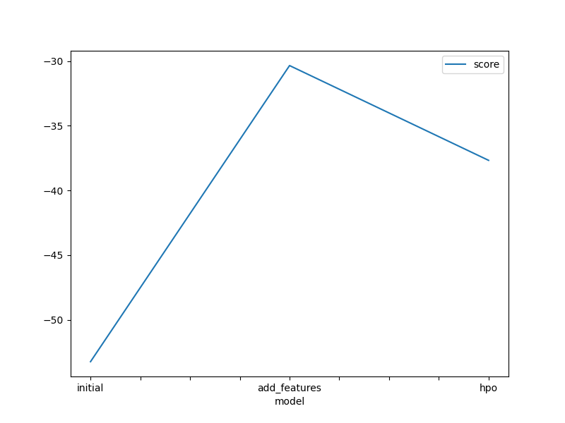
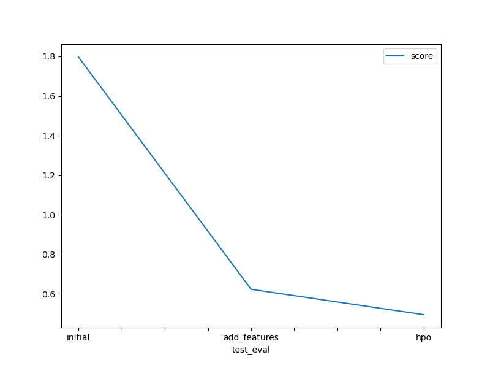

# Report: Predict Bike Sharing Demand with AutoGluon Solution
#### Martin Eser

## Initial Training
### What did you realize when you tried to submit your predictions? What changes were needed to the output of the predictor to submit your results?
TODO: When I tried to submit my predictions, I realized that Kaggle was rejecting submissions that contained negative values. This was an important realization, as some of my initial predictions could potentially include some negative values, which would have prevented me from successfully submitting my results.

To address the issue of negative values in the predictions, I needed to make the following changes to the output of my predictor:

1. **Identify Negative Values**: I carefully reviewed the output of my predictor and identified if there were any predictions that had negative values.

2. **Adjust Negative Values**: For any predictions with negative values, I modified them to ensure they were non-negative. This has been done by setting the negative values to zero. Alternatively, different transformations could be applied to ensure the final values were all positive, e.g.

$$
y_{\text{adjusted}} = \max(0, y_{\text{original}})
$$

Where $y_{\text{original}}$ is the original prediction and $y_{\text{adjusted}}$ is the adjusted, non-negative prediction.

3. **Verify Submission Readiness**: After making the necessary adjustments, I re-checked the output of my predictor to ensure all values were non-negative and would be accepted by the Kaggle submission system.

By taking these steps, I was able to successfully submit my predictions to Kaggle, despite the requirement of having only non-negative values.

### What was the top ranked model that performed?
TODO: The top rank model concerning the kaggle score was the WeightedEnsemble_L3, which was one of the models trained on the dataset with additional features and additional hyperparameter tuning. The kaggle score of the top rank model was 0.49512.

## Exploratory data analysis and feature creation
### What did the exploratory analysis find and how did you add additional features?
TODO: The exploratory data analysis (EDA) basically consisted of plotting histograms of all the features available in the initial dataset. Plotting histograms of the features provided insights into the distributions of each feature. The analysis revealed that the data consisted of two main types: categorical and continuous.
This inspection motivated to conduct additional feature engineering steps to adjust existing features and add new features, such as:

**1. Datetime column conversion:**
- The datetime column was initially of object data type, which was converted to datetime data type to enable efficient use of *dt* methods
- Additional features were created by splitting the datetime column into separate columns for year, month, day, hour, and day of the week.

**2. Feature engineering for categorical data:**
- Among the categorical features, the season and weather features were found to be more informative than the holiday and working day features, which had binary distributions.
- The season and weather features were converted from int64 to categorical data type to better capture their informative nature.

In summary, the EDA helped identify opportunities to improve the data by converting the datetime column, creating new features from the datetime information, and transforming categorical features to better represent their underlying characteristics.

### How much better did your model preform after adding additional features and why do you think that is?
TODO: After having added the hour as an addition feature, the model performed way better. The Kaggle score improved from originally 1.79681 to 0.62298 after adding this new feature. Also, the RMSE improved from initially 53.230178 to 30.349381. This behavior is reasonable in light of the problem since the hour is a very representative feature to estimate that a bike is rented rather during the day than during the night. Therefore, the additional feature and categorized data helped the model for better learning the related patterns between the features and the target.

## Hyper parameter tuning
### How much better did your model perform after trying different hyper parameters?
TODO: Hyperparameter tuning focused on gradient boosting methods since these have been among the best performing models in the first and also the second model training set-up. The number of leaves has been selected as a hyperparameter to tune. While the RMSE on the test data was slightly higher compared to the second training set-up, the best-performing hyperparameter-tuned model proved to be more accurate on unseen data, which resulted in a Kaggle score of 0.49512.

### If you were given more time with this dataset, where do you think you would spend more time?
TODO: I would invest additonal time in the following experiments:

1. Asses feature importance based on the results given from the last experiment. Some features such as holiday vs. workday seem redundant. These could be fused into more informative features, e.g. particular weekdays.
2. Increase the time_limit for AutoGluoun's TabularPredictor().fit(), which enables AutoGluoun to test more elaborate models that might potentially perform better. This is the most promissing approach to imporove prediction quality according to the AutoGluon's documentation.
3. Once, the best trained model or model family has been deduced from the results of 2., we could further fine-tune the model or the hyperparameters of the model family to further improve the efficiency.

### Create a table with the models you ran, the hyperparameters modified, and the kaggle score.
|model|time limit|presets|num_leaves|score|
|--|--|--|--|--|
|initial|600|best_quality|default|1.79681|
|add_features|600|best_quality|default|0.62298|
|hpo|300|best_quality|26-66|0.49512|

### Create a line plot showing the top model score for the three (or more) training runs during the project.

TODO: Replace the image below with your own.

### Create a line plot showing the top kaggle score for the three (or more) prediction submissions during the project.

TODO: Replace the image below with your own.

## Summary
TODO: In this project, a regression model was trained using AutoGluon to predict bike sharing demand. The dataset was obtained from the Kaggle competition, which provided historical bike sharing data for training and testing. Additional data were used when submitting the model.

The project was implemented in AWS SageMaker Studio, running on an ml.t3.medium instance (2 vCPU + 4 GiB) with a Python 3 kernel using the Data Science 3.0 image. The necessary packages, including AutoGluon and Kaggle, were installed to enable downloading and processing the data.

The initial model was trained on the raw dataset, with minimal feature engineering as two features ('casual', 'registered') have been excluded from the training process since these were not present in the test dataset. The initial model was trained using AutoGluon's TabularPredictor with a training time limit of max. 600 seconds. This initially trained model received a kaggle score of 1.79681 on the Kaggle leaderboard.

Next, exploratory data analysis (EDA) was performed. This included visualizing the available features using histogram plots. Inspecting the data revealed that more informative features could be constructed, particularly based on the datetime column. This led to improved model performance since the re-trained model reached a Kaggle score of 0.62298.

Hyperparameter tuning was then conducted, focusing on the gradient boosting methods since these have been among the best performing models in the first and also the second model training set-up. The number of leaves has been selected as a hyperparameter to tune, which had a significant impact on the results and further improved the model's performace, particularly in generalizing on unseen data. The best model from the hyperparameter tuning set-up could achieve a Kaggle score of 0.49512.

Due to cost considerations, the model fitting and hyperparameter tuning process was held to shorter training times. However, further improvements could potentially be made by continuing the experimentation and optimization process.
